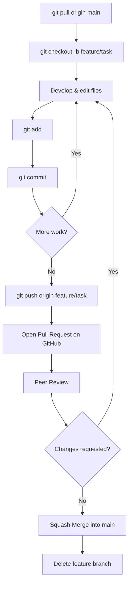

# Meridex Research Software Handbook

Welcome to the official software engineering handbook for the Meridex research group.

This handbook defines **how research software is developed, reviewed, and maintained in the group**.
It covers the complete workflow from first setup to long-term repository maintenance.

---

## Who Should Read This

=== "I am a new student"
    Start with the **[Student Guide](student/01-introduction.md)**.
    It assumes no prior Git knowledge and walks you through everything step by step.

=== "I administer a repository"
    Go to the **[Maintainer Guide](maintainer/01-repo-creation.md)**.
    It covers repository setup, branch protection, releases, and long-term maintenance.

=== "I need a quick reference"
    See the **[Cheat Sheet](student/17-cheat-sheet.md)** or the **[Glossary](appendices/glossary.md)**.

---

## The Canonical Workflow

Every piece of work in this group follows one protected workflow. There are no alternatives.

**Core rule:** No direct commits to `main`. All changes go through Pull Requests.

---

## Handbook Structure

| Section | Chapters | Purpose |
|---------|----------|---------|
| [Student Guide](student/01-introduction.md) | 18 | Git basics, daily workflow, PRs, reviews |
| [Maintainer Guide](maintainer/01-repo-creation.md) | 19 | Repository admin, policy, releases |
| [Appendices](appendices/glossary.md) | 3 | Glossary, policies, research principles |
| [Templates](../templates/) | 8 | Ready-to-use PR, issue, README templates |

---

## Key Conventions at a Glance

- Branch names: `feature/`, `bugfix/`, `docs/`, `refactor/`, `experiment/`, `chore/`
- Commit messages: imperative tense — *"Add thermal correction"*, not *"added correction"*
- Merge strategy: **Squash Merge only** — keeps `main` history clean
- Every published figure → tagged commit. Every paper → Git tag.
- No binary outputs, large data files, or generated files committed.

---

!!! tip "New to the group?"
    Read [Chapter 1 — Introduction](student/01-introduction.md) first.
    Then proceed in order through the Student Guide.
    The entire guide should take 2–3 hours to read; the exercises will take longer.
