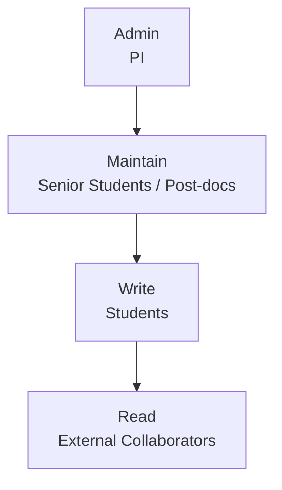

# Chapter 4 — Collaborator Management

## Overview

Access management determines who can do what in the repository.
The correct permission level for each role prevents both under-privilege
(students cannot contribute) and over-privilege (students cannot break settings).

---

## GitHub Permission Levels

GitHub has five permission levels for repository collaborators:

| Level | What they can do |
|-------|-----------------|
| **Read** | Clone and view. Cannot push. |
| **Triage** | Read + manage issues and PRs. Cannot push. |
| **Write** | Read + push branches, open PRs, create issues. Cannot change settings. |
| **Maintain** | Write + manage some settings (labels, milestones, pushes to protected branches). Cannot delete repo or change security. |
| **Admin** | Full access including settings, collaborators, and danger zone. |

---

## Group Permission Policy

| Role | GitHub Level | Rationale |
|------|-------------|-----------|
| Students | **Write** | Can push feature branches and open PRs; cannot change repository settings or branch protection |
| Post-docs / senior students | **Maintain** | Can manage labels, milestones, and merge PRs after approval |
| Principal Investigator | **Admin** | Full control including visibility changes and deletion |
| External collaborators | **Write** | Same as students; limited to specific repositories |

Never assign **Admin** to students. Never assign **Write** to external parties
without PI approval.

---

## Adding a Collaborator

### For personal repositories (not organisations):

1. **Settings → Collaborators → Add people**
2. Enter the GitHub username or institute email address.
3. Select the appropriate permission level.
4. Click **Add [username] to this repository**.
5. GitHub sends an invitation email. The collaborator must accept within 7 days.

Verify acceptance:
- Settings → Collaborators → look for "Pending" status
- Follow up if pending for more than 2 business days

### For organisation repositories:

Preferred: manage access through **Teams** rather than individual collaborators.

1. **Organisation Settings → Teams → New team**
2. Create teams: `students`, `maintainers`
3. Add members to the appropriate team
4. Grant each team access to repositories:
   - Team `students` → Write access to relevant repositories
   - Team `maintainers` → Maintain access to all repositories
5. Individual members inherit the team's permissions

Using teams means access is managed once per person (add to team) rather than
once per repository — a significant time saving as the group grows.

---

## Revoking Access

When a student leaves (graduation, exchange end, departure):

1. Before removing: complete the offboarding process (Chapter 19).
2. **Settings → Collaborators → [Username] → Remove**
3. If using teams: **Organisation Settings → Teams → [Team] → Members → Remove**

!!! note "Data is not deleted when access is revoked"
    Revoking access does not delete commits, PRs, or issue comments.
    The student's contributions remain in the repository history permanently.

---

## The Audit Log

GitHub's audit log records every administrative action: who added whom,
who changed settings, who approved a PR.

Access for organisation administrators:
**Organisation Settings → Audit log**

Access for individual repository:
**Repository → Insights → (not available) — use organisation audit log**

Use the audit log to:
- Verify that a student accepted their invitation
- Confirm who made a settings change
- Investigate unexpected repository actions
- Demonstrate accountability to the PI

Filter by actor, action type, or date range. Export to CSV for records.

---

## Common Mistakes

1. **Granting Admin to students.** Even trusted students should not have Admin.
   Admin access allows changing branch protection rules, which undermines the workflow.

2. **Not following up on pending invitations.** If a student never accepts,
   they have no access. Check invitation status the day before their first session.

3. **Forgetting to revoke access after departure.** A former student with Write access
   can still push branches to the repository indefinitely.

4. **Adding individuals instead of teams (for organisations).** Individual management
   does not scale and is error-prone.

---

## Checklist

- [ ] Student permissions set to Write (not Maintain, not Admin)
- [ ] Maintainer permissions set to Maintain
- [ ] PI permission set to Admin
- [ ] All invitations accepted (no "Pending" status)
- [ ] Teams created and used if this is an organisation repository
- [ ] Audit log checked after initial setup
