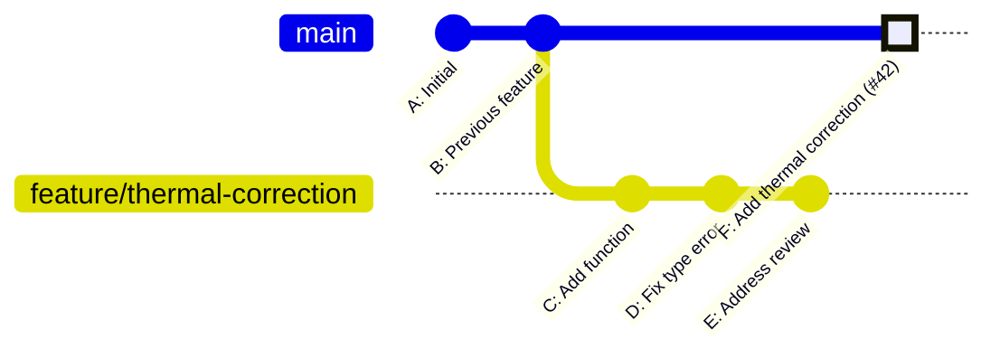

# Chapter 9 — Merge Strategy

## Overview

The group uses **Squash Merge** as the exclusive merge strategy for all PRs into `main`.
This chapter explains why, how it works, how to do it correctly, and how to handle
edge cases.

---

## Why Squash Merge?

A feature branch typically contains many small, incremental commits accumulated
during development and review:

```
feature/thermal-correction:
  a1b2c3  Add thermal integral function
  d4e5f6  Fix type error
  g7h8i9  Address review: rename variable
  j0k1l2  Address review: add bounds check
  m3n4o5  Fix sign error in edge case
```

These commits are useful during development but they are **noise** in `main`'s history.
After squash merge, `main` receives one clean commit:

```
main:
  p6q7r8  Add thermal correction to effective potential (#42)
```

**Benefits of squash merge:**

| Benefit | Explanation |
|---------|-------------|
| Clean `git log` | `main`'s history reads as one entry per logical feature |
| Readable blame | `git blame` on `main` points to the feature's PR, not an intermediate fix |
| Simpler revert | To undo a feature, revert one commit; not five |
| Audit trail preserved | The individual commits still exist in the PR's page on GitHub |

---

## How Squash Merge Works



Commits C, D, E are collapsed into F. F contains all the changes from C+D+E
as a single diff applied to B.

---

## The Squash Commit Message Convention

When squash-merging, GitHub pre-fills the commit message. Edit it to follow
the group convention:

```
Brief description of change (#PR-number)
```

Examples:
```
Add thermal correction to effective potential (#42)
Fix interpolation overflow at high temperature (#51)
Refactor phase boundary solver for readability (#63)
Update installation documentation (#71)
```

Rules:

- **Imperative tense** (same as individual commit messages)
- **PR number in parentheses** at the end — links back to the PR discussion
- **One line** is sufficient for the subject
- Optionally add a blank line and a one-sentence body for context

---

## Step-by-Step: Merging a PR

1. Open the PR page.
2. Verify:
   - [ ] Branch is up to date with `main`
   - [ ] All conversations resolved
   - [ ] CI status checks pass (once CI is active)
   - [ ] At least 1 approval from a reviewer
3. Click **"Squash and merge"**
4. Review and edit the squash commit message:
   - Subject line: imperative, includes `(#PR-number)`
   - Delete the auto-generated list of individual commit messages from the body
5. Click **"Confirm squash and merge"**
6. The feature branch is automatically deleted (if the setting in Chapter 2 is enabled)

---

## What to Do When Someone Used the Wrong Merge Strategy

If a regular merge commit accidentally appears on `main` (e.g., someone bypassed
the squash setting using the GitHub API or CLI):

```bash
git log --oneline --graph origin/main
```

If you see a merge commit (two parents), it must be reverted:

```bash
# Identify the merge commit hash
git log --oneline -5

# Revert the merge commit (keeping both parents' changes intact)
git revert -m 1 <merge-commit-hash>
git push origin main
```

Then open a new PR with the correct squash-merged content.

If the accidental regular merge brought in correct content and the only problem
is the commit structure, discuss with the PI — correcting it requires rewriting
`main` history, which has implications for all collaborators.

---

## Reverting a Squash-Merged Feature

Because squash merge produces a single commit, reverting a feature is straightforward:

```bash
git revert <squash-commit-hash>
git push origin main
```

Or via GitHub: on the merged PR page, click **"Revert"**.
This creates a new PR with the revert. Review and merge it normally.

---

## Common Mistakes

1. **Clicking "Merge pull request" instead of "Squash and merge".**
   If only squash merge is available in settings (Chapter 2), the regular merge
   option does not appear. This is the defence. If it does appear,
   always choose "Squash and merge".

2. **Leaving the default squash commit message without editing.**
   The default includes all individual commit messages as a bulleted list.
   Replace this with a single clean subject line: `Description (#N)`.

3. **Merging a PR that has unresolved conversations.**
   GitHub can block this if "Require conversation resolution" is enabled (Chapter 3).
   If it is not blocked, check manually before merging.

4. **Merging a branch that is behind `main`.**
   The merged content may not include `main`'s latest changes, causing unexpected
   results. Require the author to rebase first.

---

## Checklist

- [ ] Only "Squash and merge" is available (settings configured correctly)
- [ ] Squash commit message edited: imperative subject, `(#N)` included
- [ ] All conversations resolved before merging
- [ ] Branch was up to date with `main` before merging
- [ ] Remote branch deleted automatically after merge
