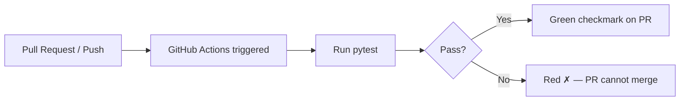

# Chapter 14 — CI Preparation

## Overview

Continuous Integration (CI) automatically runs tests and checks on every
push and Pull Request. It is the automated enforcement of the testing policy
(Chapter 13) — tests always run, no exceptions, no manual oversight required.

This chapter prepares the repository for CI using GitHub Actions.

---

## What Is CI and Why the Group Needs It

Without CI:

- Tests run only when someone remembers
- "Tests pass" in the PR description is unverifiable
- A broken `main` requires manual diagnosis

With CI:

- Tests run automatically on every PR
- A red ✗ on the PR blocks merge (once status checks are required in Chapter 3)
- `main` is always in a tested state

For a research group where code correctness directly determines paper results,
CI is essential, not optional.



---

## GitHub Actions Basics

GitHub Actions workflows are defined in YAML files in `.github/workflows/`.

Key concepts:

| Concept | Meaning |
|---------|---------|
| **Workflow** | A YAML file defining automated jobs |
| **Trigger** (`on:`) | When the workflow runs (push, PR, schedule) |
| **Job** | A group of steps that run on one machine |
| **Step** | One command or action within a job |
| **Action** | A reusable step from the GitHub Marketplace |
| **Runner** | The virtual machine that runs the job (`ubuntu-latest`, `macos-latest`) |

---

## Minimal Python Test Workflow

Create `.github/workflows/tests.yml`:

```yaml
name: Tests

on:
  push:
    branches: [ main ]
  pull_request:
    branches: [ main ]

jobs:
  test:
    name: Run pytest
    runs-on: ubuntu-latest

    steps:
      - name: Checkout code
        uses: actions/checkout@v4

      - name: Set up Python
        uses: actions/setup-python@v5
        with:
          python-version: '3.11'

      - name: Install dependencies
        run: |
          python -m pip install --upgrade pip
          pip install -r requirements.txt

      - name: Run tests
        run: |
          python -m pytest --tb=short -v
```

This workflow runs on every push to `main` and every PR targeting `main`.

---

## Testing Multiple Python Versions

For code that must support multiple Python versions:

```yaml
jobs:
  test:
    runs-on: ubuntu-latest
    strategy:
      matrix:
        python-version: ["3.10", "3.11", "3.12"]

    steps:
      - uses: actions/checkout@v4
      - uses: actions/setup-python@v5
        with:
          python-version: ${{ matrix.python-version }}
      - run: pip install -r requirements.txt
      - run: python -m pytest
```

---

## After CI Is Active: Updating Branch Protection

Once the CI workflow is running and producing green/red status checks,
update the branch protection rule (Chapter 3) to require CI to pass:

1. **Settings → Branches → Edit rule for `main`**
2. Under "Require status checks to pass":
   - Click in the search box
   - Type the job name from your workflow (e.g., `Run pytest`)
   - Select it
3. Save

Now PRs cannot be merged if tests fail.

---

## Adding a CI Status Badge to README

Show the test status on the repository's main page:

```markdown
[](https://github.com/Meridex/REPO/actions/workflows/tests.yml)
```

Add this near the top of `README.md`.

---

## Future Workflow Expansions

Add these workflows incrementally as the codebase matures:

### Code Style (flake8 / ruff)

```yaml
- name: Lint with ruff
  run: |
    pip install ruff
    ruff check src/ tests/
```

### Type Checking (mypy)

```yaml

- name: Type check with mypy
  run: |
    pip install mypy
    mypy src/
```

### Documentation Build

```yaml

- name: Build MkDocs
  run: |
    pip install mkdocs-material
    mkdocs build --strict
```

---

## Common Mistakes

1. **Not pinning action versions.** Use `@v4` not `@latest` to prevent unexpected
   breakage when action maintainers release breaking changes.

2. **Workflow runs but status check is not required.** After adding the workflow,
   update branch protection (Chapter 3) to require it. The workflow existing is
   not enough — it must be required.

3. **Tests pass locally but fail on CI.** Common causes: missing dependency in
   `requirements.txt`, hardcoded local file paths, OS-specific behaviour.
   Check the CI log for the exact error.

---

## Checklist

- [ ] `.github/workflows/tests.yml` created
- [ ] Workflow triggers on push to `main` and on PRs
- [ ] `requirements.txt` is complete and accurate
- [ ] CI runs successfully on a test PR (green check appears)
- [ ] Branch protection updated to require the CI status check
- [ ] CI badge added to `README.md`
