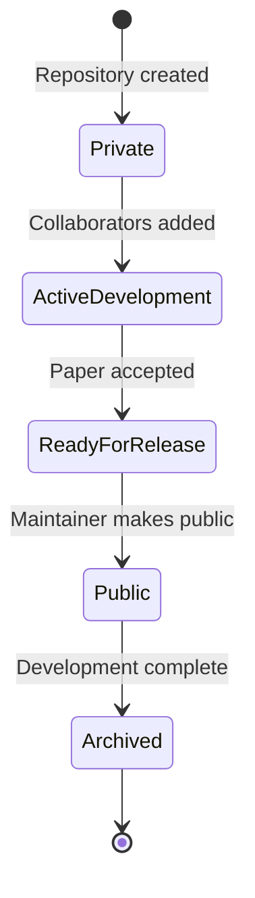

# Chapter 17 — Public Transition

## Overview

All group repositories start private. When a paper is accepted for publication
or posted to arXiv, the corresponding code repository transitions to public.

This is a deliberate, checklist-driven process. A public repository is visible
to the entire world — including future employers of your students, collaborators,
and the referees of your next paper.

The public transition is the `ReadyForRelease → Public` step in the repository lifecycle:



---

## When to Go Public

| Trigger | Action |
|---------|--------|
| Paper accepted by journal | Make repository public |
| Paper posted to arXiv | Make repository public |
| Code explicitly shared with external collaborators | Make repository public after checklist |
| Code submitted with a grant application | Discuss with PI first |
| Early-stage research code | Keep private |

**Never make a repository public without PI approval.**
The decision involves intellectual property, collaboration agreements, and
the group's publication strategy.

---

## Pre-Transition Checklist

Work through this checklist before changing visibility. Each item is important.

### Security

- [ ] **Scan for secrets in the full Git history:**
  ```bash
  git log -p | grep -iE '(password|api.key|secret|token|private|credential)' | head -100
  ```
  If anything is found, stop and consult the PI. Removing secrets from Git history
  requires `git filter-repo` or BFG Repo-Cleaner and coordination with all collaborators.

- [ ] **No unpublished data in the repository.**
  Data files that correspond to results not yet published should not be in the history.

- [ ] **No credentials in configuration files** (`.env`, `config.yaml`, etc.).

### Content

- [ ] **LICENSE is present and correct.**
  The group default is MIT. Confirm with PI for any deviation.
  Without a license, the code is technically "all rights reserved."

- [ ] **README is complete and accurate.**
  A public README is a scientific document. It should include:
  - What the code does
  - How to install and run it
  - The paper citation with DOI
  - Contact information

- [ ] **`CITATION.cff` is present** (Chapter 16).

- [ ] **All temporary, experimental, and abandoned branches are deleted.**
  `git branch -a` should show only `main` and any intentionally preserved branches.

- [ ] **No embarrassing in-progress notes** in README or docs.
  Comments like "TODO: fix this garbage" are now public.

### State

- [ ] **A release has been created** corresponding to the paper version (Chapter 10).

- [ ] **All tags have been pushed** (`git push --tags origin`).

- [ ] **Tests pass on `main`**.

- [ ] **CI passes** (if configured).

- [ ] **PI has explicitly approved** (document this approval — a Slack message, email, or meeting note).

---

## Making the Repository Public

1. **Settings → Danger Zone → Change repository visibility**
2. Click **"Make public"**
3. Read the warning:
   - The repository will be publicly visible.
   - This cannot be undone without making it private again.
   - All history becomes public.
4. Type the repository name to confirm.
5. Click **"I understand, make this repository public."**

---

## After Going Public

- **Announce** to collaborators and the community:
  - Add a GitHub link to the paper (if the journal/arXiv allows)
  - Post on the group website
  - Notify co-authors
  - Post on the group's social media / mailing list

- **Add to the group's public repository list** in the organisation README.

- **Monitor issues.** Once public, external users may open issues and PRs.
  Decide in advance whether the group will engage with external contributions.

---

## After Going Public: Handling External Contributions

If external users open PRs:

- Apply the same review standards as for internal PRs.
- Do not merge code from unknown contributors without thorough review.
- Add a `CONTRIBUTING.md` file explaining the contribution process.

If the group does not wish to accept external contributions:
Add a notice to the README:
```markdown
> **Note:** This repository is provided for reproducibility of the results in
> [paper]. We do not actively maintain it or accept pull requests from
> external contributors. Please open an issue for questions.
```

---

## Common Mistakes

1. **Making the repository public without scanning for secrets.**
   Once public, any secret that appeared in the Git history is compromised,
   even if you delete the file later. The history is permanently public.

2. **Going public without a license.**
   Without `LICENSE`, the code is legally unusable by others, defeating the
   purpose of open-sourcing it.

3. **Going public with a broken `main`.**
   The first impression matters. Ensure `main` is working, documented,
   and tested before transition.

---

## Checklist

- [ ] History scanned for secrets — none found
- [ ] No unpublished data in repository
- [ ] LICENSE present and correct
- [ ] README complete (description, installation, citation, contact)
- [ ] `CITATION.cff` present
- [ ] All stale branches deleted
- [ ] Final release and tag created
- [ ] Tests pass on `main`
- [ ] PI has explicitly approved
- [ ] Repository made public
- [ ] Announcement sent (group website, co-authors, social media)
- [ ] Added to organisation public repository list
