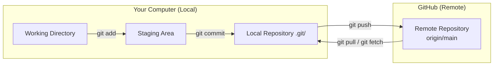

# Chapter 2 — Git vs GitHub

## Overview: Why Does the Distinction Matter?

The single most common source of confusion for new users is conflating Git and GitHub.
They are **two separate things** that work together. Understanding the difference is
essential before any command makes sense.

---

## What Is Git?

**Git** is a version control system — a program that runs on your computer.

It tracks changes to files over time. When you run `git commit`, Git takes a snapshot
of your staged files and records it in a local database stored in the hidden `.git/`
folder inside your project directory.

Key properties of Git:

- **Local.** Git works entirely on your machine. No internet connection is needed
  to commit, branch, diff, or view history.
- **Distributed.** Every clone of a repository contains the complete history.
  There is no single "master copy" — although in practice, one remote serves as the
  canonical reference.
- **Free and open source.** Created by Linus Torvalds in 2005 for Linux kernel development.

Git is installed as a command-line tool:

```bash
git --version
# git version 2.44.0
```

---

## What Is GitHub?

**GitHub** is a web platform that hosts Git repositories.

It provides:

- **Remote storage** — a place to push your local commits so others can access them.
- **Collaboration tools** — Pull Requests, code review, issue tracking, project boards.
- **Visibility** — repository pages, contributor graphs, commit history browsing.
- **Automation** — GitHub Actions for CI/CD, automated testing, and deployment.

GitHub is where the group organises its work. You interact with it through:

1. The GitHub web interface (browser)
2. Git commands on your terminal (via SSH)
3. The GitHub CLI (optional, not covered in this handbook)

!!! note "Other platforms"
    GitLab and Bitbucket offer similar services. This group uses GitHub exclusively.
    The concepts in this handbook transfer to other platforms, but the specific
    interface instructions do not.

---

## How They Relate: Local ↔ Remote



**The workflow in one sentence:**
You edit files locally, commit them to your local Git repository,
then push those commits to GitHub where your collaborators can see and review them.

---

## Key Vocabulary

Understanding these terms is required before proceeding:

| Term | Where it lives | Meaning |
|------|---------------|---------|
| **Repository** | Local & Remote | The project folder tracked by Git, including all history |
| **Commit** | Local (then pushed) | A saved snapshot with a message, author, and timestamp |
| **Branch** | Local & Remote | An independent line of commits; `main` is the default |
| **Remote** | Remote | A named reference to a repository on GitHub; default name is `origin` |
| **Clone** | — | Copying a remote repository to your local machine |
| **Push** | — | Sending local commits to the remote |
| **Pull** | — | Fetching remote commits and integrating them locally |
| **Fork** | Remote | A personal copy of someone else's repository on GitHub |

!!! warning "Fork ≠ Clone"
    **Cloning** downloads a repository to your machine.
    **Forking** creates a copy of a repository under your own GitHub account.
    In this group, students **clone** the group repository — they do not fork it.

---

## What the Group Uses GitHub For

In this group, GitHub serves as:

1. **The canonical remote** — `origin/main` is the authoritative version of the code.
2. **The Pull Request gate** — all changes are reviewed on GitHub before merging.
3. **The issue tracker** — bugs, tasks, and ideas are logged as Issues.
4. **The release record** — tagged releases mark paper submissions and milestones.

---

## Common Mistakes

1. **Thinking "I pushed to Git."** You push to GitHub (the remote). Git is the
   local tool. Say "I pushed to GitHub" or "I pushed to origin."
2. **Editing files directly on GitHub's web editor** for anything beyond trivial
   one-line fixes. Always work locally, then push.
3. **Confusing `git pull` and `git clone`.** `clone` is a one-time operation to get
   a local copy. `pull` is used regularly to sync changes after you already have a clone.

---

## Best Practice Summary

- Git is a local tool; GitHub is a remote hosting platform. They are different things.
- Every `git push` sends commits from your local Git repo to GitHub.
- Every `git pull` brings commits from GitHub into your local Git repo.
- Students clone the group repository — they do not fork it.
- The remote is named `origin` by default; `origin/main` is the canonical branch.

---

## Checklist

- [ ] I can explain the difference between Git and GitHub in one sentence.
- [ ] I understand what "local" and "remote" mean in this context.
- [ ] I understand the role of `origin` and `main`.
- [ ] I know the difference between clone and fork.

---

## Exercises

1. **Diagram.** On paper (or a whiteboard), draw the local ↔ remote diagram
   from memory. Label: working directory, staging area, local repo, remote repo,
   and the four operations: add, commit, push, pull.

2. **Explore GitHub.** In the group's GitHub repository, find:
   - The list of branches
   - The commit history of `main`
   - One closed Pull Request
   - One open Issue
   You do not need to interact — just locate them.

3. **Vocabulary check.** Ask a colleague (or write in your notes):
   What happens step by step when you run `git push origin feature/my-task`?
