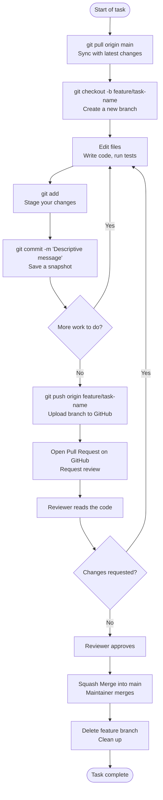
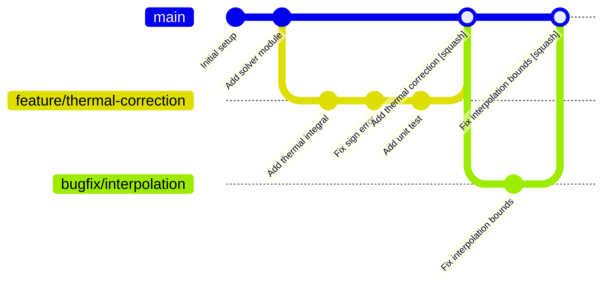

# Chapter 3 — Development Workflow Overview

## Overview: See the Map Before You Walk the Path

Before learning individual commands, you need to understand the complete picture.
This chapter shows the entire group workflow from start to finish.
Every subsequent chapter is a deep dive into one piece of this map.

Do not skip this chapter. If you understand the workflow conceptually,
every command you learn will have an obvious purpose.

---

## The Canonical Group Workflow

This is the workflow used for **every change** in every group repository.
There are no exceptions.



---

## The Five Pillars of the Workflow

### 1. Protected `main` Branch

The `main` branch is the **single source of truth** for the project.
It should always be in a working state — code on `main` builds, runs, and produces
correct results.

**Direct commits to `main` are blocked by branch protection rules.**
You cannot push to `main` even if you try. All changes arrive via Pull Requests.

### 2. Feature Branches

Every task — a new calculation, a bug fix, a documentation update — gets its own branch.

```
main
├── feature/thermal-correction
├── bugfix/interpolation-overflow
└── docs/installation-guide
```

Branches are **isolated**. Work on `feature/thermal-correction` does not affect
`bugfix/interpolation-overflow`. You can switch between them freely.

Branches are **disposable**. After a branch is merged, it is deleted. Never reuse
an old branch for a new task.

### 3. The Pull Request Gate

A Pull Request (PR) is a formal request to merge your branch into `main`.

PRs serve three purposes:

1. **Review** — at least one other group member reads your changes before they are accepted.
2. **Discussion** — the PR page is where questions, suggestions, and corrections are recorded.
3. **History** — the merged PR is a permanent record of what changed and why.

Every change to `main` has a corresponding PR. There are no silent changes.

### 4. Squash Merge

When a PR is approved, it is merged using **Squash Merge**.

Squash merge takes all the commits on your feature branch (which may be messy —
"fix typo", "try again", "actually fix it") and combines them into a **single,
clean commit** on `main`.

```
Before merge (feature branch):
  A - B - C - D - E   (your messy work commits)

After squash merge (main):
  ...existing... - F   (one clean commit representing all of A–E)
```

This keeps the `main` branch history clean and readable. Each entry in `main`'s
history represents one complete, logical change.

### 5. Delete After Merge

After a branch is merged, it is **deleted** — both on GitHub and locally.

This keeps the repository tidy. A proliferation of stale branches is a maintenance problem.

---

## Branch Lifetime Visualised



Notice that `main` only receives **one commit per merged PR**, regardless of how many
commits were on the feature branch.

---

## Why This Workflow?

This workflow is designed specifically for a **small research group** (3–10 developers):

| Requirement | How the workflow addresses it |
|-------------|------------------------------|
| Reproducible results | `main` always works; every change is traceable to a PR |
| Knowledge sharing | Code review spreads understanding across the group |
| Error prevention | PRs catch mistakes before they reach `main` |
| Clean history | Squash merge makes `git log` on `main` readable |
| Accountability | Every change has an author, a reviewer, and a timestamp |
| Safe experimentation | Feature branches are isolated; nothing breaks `main` |

---

## Common Mistakes

1. **Working directly on `main`.** Even if branch protection were not enforced,
   this is wrong practice. Always create a branch.

2. **One massive branch for everything.** Each branch should represent one
   focused task. Large branches are hard to review and hard to merge.

3. **Not pulling before starting work.** If you start a branch from a stale `main`,
   your branch will diverge quickly and conflicts will accumulate.

4. **Forgetting to delete the branch after merge.** Stale branches clutter the repository.

---

## Best Practice Summary

- Every change starts with a `git pull` and a new branch from `main`.
- Branches are short-lived, focused, and named descriptively.
- All changes reach `main` through a Pull Request with at least one approval.
- Squash merge keeps `main` history clean.
- Delete branches after merge.

---

## Checklist

- [ ] I can describe the full group workflow from memory (without looking at this chapter).
- [ ] I understand why direct commits to `main` are forbidden.
- [ ] I understand the purpose of a Pull Request.
- [ ] I understand what squash merge does to commit history.
- [ ] I know why branches are deleted after merge.

---

## Exercises

1. **Draw the workflow.** Close this page and draw the full workflow diagram from memory.
   Check your drawing against the flowchart above.

2. **Trace a PR.** Find a merged Pull Request in the group's GitHub repository.
   Identify:
   - The branch name
   - The number of commits on the branch
   - The single squash-merge commit it produced on `main`
   - The reviewer who approved it

3. **Explain squash merge.** Explain to a colleague (or write in your notes)
   why the group uses squash merge instead of regular merge. What problem does it solve?
