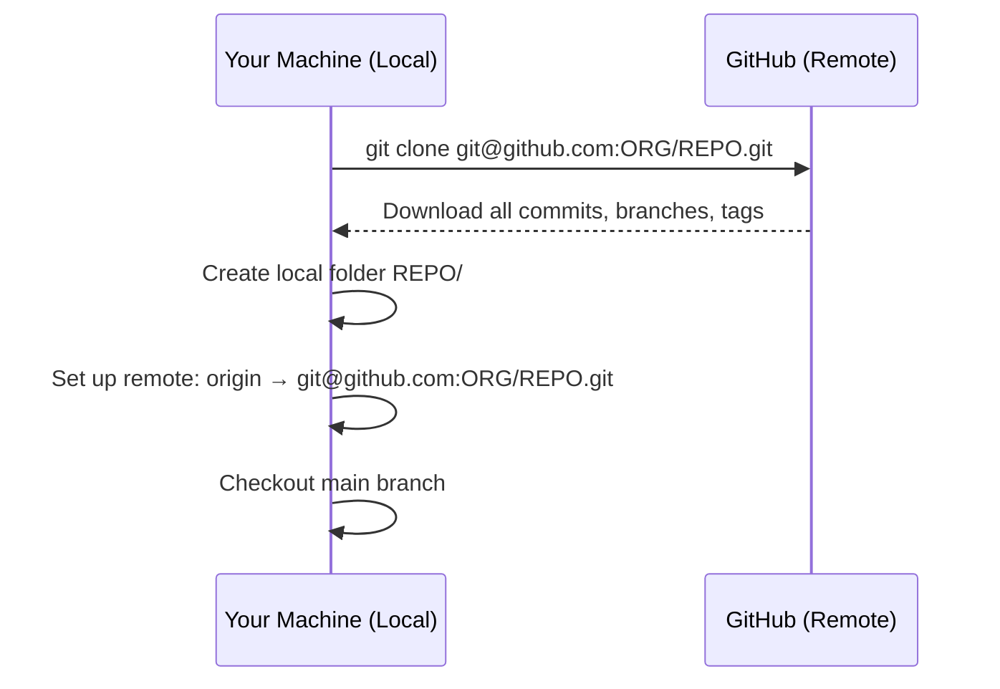

# Chapter 6 — Cloning the Repository

## Overview: Getting a Local Copy

Cloning is the one-time operation of downloading a repository from GitHub to your machine.
After cloning, you have a complete local copy of the project including its full history.

You only clone a repository once. After that, you use `git pull` to keep it up to date.

---

## What `git clone` Does

When you run `git clone`:

1. Git downloads the entire repository from GitHub to a new local folder.
2. Git creates a `.git/` directory inside that folder — this is where Git stores all history.
3. Git sets up a remote called `origin` pointing to the GitHub URL you cloned from.
4. Git checks out the default branch (`main`) so you have working files immediately.



---

## Step 1: Find the SSH URL on GitHub

1. Navigate to the group repository on GitHub.
2. Click the green **Code** button.
3. Select the **SSH** tab (not HTTPS — the group uses SSH).
4. Copy the URL. It looks like:

```
git@github.com:ORG/REPO.git
```

!!! warning "Use SSH, not HTTPS"
    If you accidentally copy the HTTPS URL (`https://github.com/...`), your pushes
    will fail because the group uses SSH authentication.
    Always use the SSH tab.

---

## Step 2: Choose Your Working Directory

Navigate to the directory where you want to store the repository.
A common convention is a dedicated `projects/` or `research/` folder:

```bash
cd ~/projects
```

Create this directory if it does not exist:

```bash
mkdir -p ~/projects
cd ~/projects
```

---

## Step 3: Clone the Repository

```bash
git clone git@github.com:ORG/REPO.git
```

Replace `ORG/REPO` with the actual organisation and repository name.

Example for a repository named `phase-transition-solver`:

```bash
git clone git@github.com:nnu-pp/phase-transition-solver.git
```

Git will print output like:

```
Cloning into 'phase-transition-solver'...
remote: Enumerating objects: 342, done.
remote: Counting objects: 100% (342/342), done.
remote: Compressing objects: 100% (198/198), done.
Receiving objects: 100% (342/342), 2.14 MiB | 3.2 MiB/s, done.
Resolving deltas: 100% (89/89), done.
```

A new directory `phase-transition-solver/` has been created.

---

## Step 4: Explore What Was Created

Enter the repository directory:

```bash
cd phase-transition-solver
```

Look at the directory structure:

```bash
ls -la
```

Notable items:

| Item | Description |
|------|-------------|
| `.git/` | Hidden directory containing all Git history and metadata |
| `README.md` | The repository's root documentation file |
| Source files | The actual project files |

!!! note "Don't modify `.git/`"
    Never manually edit files inside `.git/`. This is Git's internal database.
    All interaction happens through `git` commands.

---

## Step 5: Verify the Remote

Confirm that `origin` is correctly set to the GitHub repository:

```bash
git remote -v
```

Expected output:

```
origin  git@github.com:ORG/REPO.git (fetch)
origin  git@github.com:ORG/REPO.git (push)
```

Both fetch and push point to the same SSH URL. This is correct.

---

## Step 6: Verify the History

Check the recent commits on the main branch:

```bash
git log --oneline -10
```

Example output:

```
a3f2c91 Add gravitational wave spectrum calculation
9e1b4d2 Fix phase boundary detection near critical point
7d3a8e0 Refactor thermal integral for readability
c21f907 Add unit tests for bubble nucleation rate
...
```

Each line is one commit: a short hash and a message.

---

## Understanding `origin/main`

After cloning, you have two kinds of references to `main`:

| Reference | What it is |
|-----------|-----------|
| `main` | Your local branch — where you will do work |
| `origin/main` | A read-only snapshot of what GitHub has — updated when you `fetch` or `pull` |

When you run `git pull`, Git fetches new commits from `origin/main` and integrates
them into your local `main`.

---

## Cloning with a Custom Directory Name

By default, `git clone` creates a directory with the same name as the repository.
To use a different name:

```bash
git clone git@github.com:ORG/REPO.git my-local-name
```

This is rarely needed but useful if you maintain multiple versions.

---

## Common Mistakes

1. **Cloning via HTTPS instead of SSH.** Check the URL — it should start with
   `git@github.com:`, not `https://github.com/`. If you cloned via HTTPS,
   fix the remote:
   ```bash
   git remote set-url origin git@github.com:ORG/REPO.git
   ```

2. **Cloning into a directory that is already a Git repository.** Nested
   Git repositories cause problems. Run `git status` in your current directory
   before cloning to confirm you are not inside another repo.

3. **Running `git clone` again instead of `git pull`.** After the initial clone,
   never run `git clone` again to get updates. Use `git pull origin main`.

4. **Cloning to a path with spaces.** Paths with spaces cause issues in some
   shell scripts. Prefer `~/projects/phase-transition-solver` over
   `~/My Projects/phase-transition-solver`.

---

## Best Practice Summary

- Clone once; update with `git pull`.
- Always use the SSH URL.
- Clone into a dedicated, space-free directory path.
- Verify the remote with `git remote -v` after cloning.
- Verify the history with `git log --oneline` to confirm the clone worked.

---

## Checklist

- [ ] I found the SSH URL on GitHub (Code → SSH tab).
- [ ] I ran `git clone git@github.com:ORG/REPO.git` successfully.
- [ ] `git remote -v` shows `origin` pointing to the SSH URL.
- [ ] `git log --oneline` shows recent commits.
- [ ] I understand the difference between `main` and `origin/main`.

---

## Exercises

1. **Clone the repository.** Follow the steps above to clone the group repository
   to your machine. Verify with `git remote -v` and `git log --oneline`.

2. **Explore the structure.** Run `ls -la` and explore the directory structure.
   What source files are at the top level? Is there a `src/` directory? A `tests/` directory?

3. **Find the latest commit.** Run `git log --oneline -5`. What was the most
   recent change? Who made it?
