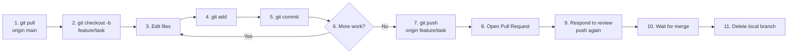

# Chapter 7 — Daily Workflow

## Overview: The Core Loop

This chapter describes the workflow you will use **every single day**.
Master this loop — it covers 95% of everything you will do with Git.

The daily workflow is eleven steps. By the end of this chapter, each step
will be second nature.

---

## The Full Daily Loop



---

## Step 1: Sync with the Latest Changes

Before starting any work, bring your local `main` up to date with GitHub:

```bash
git checkout main
git pull origin main
```

This is mandatory. If you branch from a stale `main`, your branch will be out
of date immediately and diverge further with every passing day.

```
Before pull:          After pull:
main: A-B-C           main: A-B-C-D-E
                      (D and E were added by colleagues)
```

---

## Step 2: Create a Feature Branch

Never work directly on `main`. Create a new branch for every task:

```bash
git checkout -b feature/describe-your-task
```

This command:

1. Creates a new branch named `feature/describe-your-task`
2. Switches you to that branch immediately

You are now on the new branch. Confirm with:

```bash
git branch
# * feature/describe-your-task
#   main
```

The `*` shows your current branch.

**Branch naming rules:**

| Prefix | Use for |
|--------|---------|
| `feature/` | New functionality or calculation |
| `bugfix/` | Fixing an incorrect result or crash |
| `docs/` | Documentation changes only |
| `refactor/` | Restructuring without changing behaviour |
| `experiment/` | Exploratory work that may be discarded |
| `chore/` | Build configuration, CI, tooling |

Examples: `feature/thermal-correction`, `bugfix/interpolation-overflow`,
`docs/update-installation`, `refactor/solver-class`

---

## Step 3: Do Your Work

Edit files, write code, run simulations. This is your normal scientific work.

No special Git operations are needed while you work. Git does not automatically
track changes — you explicitly choose what to record (Step 4).

---

## Step 4: Stage Your Changes

Staging is the process of selecting which changes to include in the next commit.

**Check what has changed:**

```bash
git status
```

Example output:

```
On branch feature/thermal-correction
Changes not staged for commit:
  (use "git add <file>..." to update what will be staged)

        modified:   src/thermal.py
        modified:   src/potential.py

Untracked files:
  (use "git add <file>..." to include in what will be committed)

        tests/test_thermal.py
```

**Stage specific files:**

```bash
git add src/thermal.py
git add tests/test_thermal.py
```

**Stage all changes at once** (use with care):

```bash
git add .
```

!!! tip "Interactive staging"
    `git add -p` opens an interactive mode where you can review and selectively stage
    individual *hunks* (sections of a diff). Use this when a file contains multiple
    unrelated changes and you want to split them into separate commits.

**Review what is staged before committing:**

```bash
git diff --staged
```

This shows exactly what will go into the next commit. Always check this before committing.

---

## Step 5: Commit Your Changes

Save a snapshot of the staged changes with a meaningful message:

```bash
git commit -m "Add one-loop thermal correction to effective potential"
```

**Commit message rules:**

- Use the **imperative** tense: *"Add …"*, *"Fix …"*, *"Improve …"*, *"Refactor …"*
- Be specific: describe *what* changed and *why* (not *how*)
- Keep the subject line under 72 characters
- Bad examples: `update`, `fix`, `changes`, `final`, `wip`

For a more detailed message with a body:

```bash
git commit -m "Add thermal correction to effective potential

Implements the one-loop thermal correction following Eq. 3.7 of
Quiros (1999). The correction is only active when T > 0.
Closes #42."
```

**What to commit:**

- Source code changes
- Test additions or modifications
- Documentation updates
- Configuration changes

**What NOT to commit:**

| Item | Why |
|------|-----|
| Binary outputs (`.pdf`, `.png`) | Large; regenerated; not diffable |
| Large data files (`.hdf5`, `.csv`) | Bloat the repository |
| Generated files (`__pycache__/`, `*.pyc`) | Rebuilt automatically |
| Temporary files (`.DS_Store`, `.ipynb_checkpoints`) | Machine-specific noise |
| Credentials or API keys | Security risk |

These are excluded by the `.gitignore` file in the repository.

---

## Step 6: Repeat Steps 3–5

Commit early and often. A commit should represent one **logical unit of work**,
not an entire day's work.

Think of commits as a lab notebook — each entry records one discrete step forward.

```
Good commit sequence:
  - "Add thermal integral function"
  - "Add unit test for thermal integral"
  - "Fix sign error in thermal integral"
  - "Add documentation for thermal integral"

Bad commit sequence:
  - "work"
  - "more work"
  - "finally done"
  - "fix"
```

---

## Step 7: Push Your Branch to GitHub

When you are ready for review (or want to back up your work), push your branch:

```bash
git push origin feature/thermal-correction
```

The **first time** you push a new branch, add `-u` to set the upstream tracking:

```bash
git push -u origin feature/thermal-correction
```

After that, subsequent pushes can omit `origin feature/...`:

```bash
git push
```

After pushing, GitHub will display a link to open a Pull Request:

```
remote: Create a pull request for 'feature/thermal-correction' on GitHub by visiting:
remote:      https://github.com/Meridex/REPO/pull/new/feature/thermal-correction
```

---

## Step 8: Open a Pull Request

Go to the GitHub repository in your browser. You will see a yellow banner:

> **feature/thermal-correction** had recent pushes. [Compare & pull request]

Click it and fill in the PR form. (Full details in Chapter 11.)

---

## Step 9: Respond to Review

Your reviewer may request changes. Do not open a new PR — simply make the
changes on the same branch, commit, and push again:

```bash
# Make the requested changes
git add src/thermal.py
git commit -m "Address review: fix edge case at T=0"
git push
```

The PR updates automatically. Mark reviewer comments as resolved.

---

## Step 10: Wait for Approval and Merge

Once the reviewer approves, the maintainer will squash-merge the PR into `main`.
You do not need to do anything at this step.

---

## Step 11: Clean Up After Merge

After the branch is merged, delete it:

```bash
git checkout main
git pull origin main
git branch -d feature/thermal-correction
```

The remote branch is deleted automatically by GitHub after merge (if the repository
setting "Automatically delete head branches" is enabled).

---

## Common Mistakes

1. **Skipping `git pull` at the start of the day.** Your branch will be based on
   a stale `main` and accumulate conflicts.

2. **Committing everything in one giant commit.** This makes review difficult and
   makes it impossible to trace when a bug was introduced.

3. **Staging with `git add .` without checking `git status` first.**
   You may accidentally commit generated files or temporary files.

4. **Working on `main` instead of a feature branch.** Git may allow this locally,
   but your push to `main` will be rejected by branch protection.

5. **Forgetting to push before opening the PR.** The PR cannot be created if
   the branch is not on GitHub.

---

## Best Practice Summary

- Always start with `git pull origin main`.
- Create one branch per task; never reuse old branches.
- Commit in logical units with descriptive imperative messages.
- Review staged changes with `git diff --staged` before every commit.
- Delete branches after merge.

---

## Checklist

- [ ] I ran `git pull origin main` before starting work.
- [ ] I created a properly named feature branch.
- [ ] I made atomic commits with descriptive messages.
- [ ] I reviewed staged changes with `git diff --staged` before committing.
- [ ] I pushed my branch to GitHub.
- [ ] I deleted the local branch after the PR was merged.

---

## Exercises

1. **Full loop practice.** In the example repository (see Chapter 18 exercises),
   perform the complete daily loop: pull, branch, edit a file, stage, commit, push,
   open a PR.

2. **Commit anatomy.** Write three example commit messages for hypothetical changes
   to a physics simulation code. Make one message too vague, one too long, and one
   that follows the imperative rule correctly.

3. **`git status` practice.** In your local clone, make several small edits.
   Run `git status` and identify which files are modified, staged, and untracked.
   Stage only some of them and commit.
