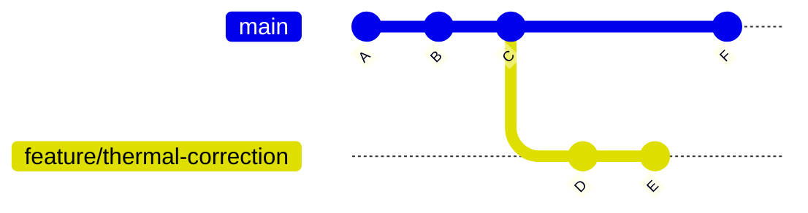

# Chapter 8 — Branches

## Overview: Isolation and Parallel Work

A branch is an independent line of development that diverges from `main` at a
specific point in time. Branches allow you to work on a feature, bug fix, or
experiment in complete isolation — without affecting anyone else's work and without
putting the stability of `main` at risk.

Understanding branches conceptually will help you use them confidently.

---

## What Is a Branch?

In Git, a branch is simply a **movable pointer to a commit**.

When you create a branch, Git records which commit you branched from.
As you add new commits, the branch pointer advances. The original branch
(e.g., `main`) does not move until you explicitly merge something into it.



In this diagram:

- `main` advanced from C to F while `feature/thermal-correction` was being developed.
- `feature/thermal-correction` contains commits D and E that `main` does not (yet) have.
- Neither branch is "ahead" — they just diverged from commit C.

---

## Why Use Branches?

| Benefit | Explanation |
|---------|-------------|
| **Isolation** | Work on a new feature without breaking the working code on `main` |
| **Parallel development** | Multiple people work on different things simultaneously |
| **Safe experimentation** | Try ideas without permanent consequences |
| **Clean review** | A PR shows exactly what one focused task changed |
| **Easy revert** | If a branch turns out wrong, simply discard it |

---

## Branch Naming Convention

The group uses a **prefix/description** naming scheme.
All lowercase, hyphens for spaces, no special characters.

| Prefix | Use case | Example |
|--------|----------|---------|
| `feature/` | New functionality or calculation | `feature/gw-spectrum` |
| `bugfix/` | Fix a known bug or incorrect result | `bugfix/interpolation-overflow` |
| `docs/` | Documentation changes only | `docs/update-installation` |
| `refactor/` | Code restructuring without behaviour change | `refactor/solver-class` |
| `experiment/` | Exploratory work; may never be merged | `experiment/neural-potential` |
| `chore/` | Build system, CI, tooling, dependencies | `chore/update-dependencies` |

**Rules:**

- Use lowercase only
- Use hyphens, not underscores or spaces
- Be descriptive — `feature/gw-spectrum` is better than `feature/new-stuff`
- Keep it short — `bugfix/fix-interpolation-overflow-in-thermal-integral` is too long

---

## Branch Commands

### Create and switch to a new branch

```bash
git checkout -b feature/my-task
```

This is equivalent to:

```bash
git branch feature/my-task   # create
git checkout feature/my-task # switch
```

### Check your current branch

```bash
git branch
```

Output:

```
* feature/my-task
  main
```

The `*` marks the active branch.

### List all branches (local and remote)

```bash
git branch -a
```

### Switch to an existing branch

```bash
git checkout main
```

Or with the newer syntax:

```bash
git switch main
```

### Delete a branch (after it is merged)

```bash
git branch -d feature/my-task
```

The `-d` flag is safe — it refuses to delete if the branch has not been merged.
Use `-D` (capital) only if you intentionally want to discard unmerged work.

### Delete the remote tracking reference

```bash
git remote prune origin
```

This removes stale references to remote branches that have been deleted on GitHub.

---

## Keeping Your Branch Up to Date with `main`

When `main` advances while you are working on a branch, your branch becomes **stale**.
You should update it before opening a PR to avoid conflicts.

The group's preferred strategy is **rebase** (covered in detail in Chapter 14):

```bash
git fetch origin
git rebase origin/main
```

This replays your commits on top of the latest `main`.

!!! warning "Update before opening a PR"
    Always check whether `main` has advanced since you branched.
    Run `git fetch origin` and look at `git log --oneline origin/main`.
    If new commits exist, rebase before opening the PR.

---

## One Branch Per Task

**Never reuse an old branch for a new task.**

After a branch is merged:

1. Delete it locally: `git branch -d feature/old-task`
2. Start fresh: `git checkout main && git pull origin main && git checkout -b feature/new-task`

Reusing branches creates confusion in PR history, muddles commit messages,
and increases the likelihood of conflicts.

---

## Common Mistakes

1. **Working directly on `main`.** Even if your push were not blocked, this is wrong.
   `main` should only receive squash-merge commits from reviewed PRs.
   ```bash
   # Check your current branch before every commit:
   git branch
   ```

2. **Branches with spaces or uppercase letters.**
   ```bash
   # Wrong:
   git checkout -b "Feature New Solver"
   git checkout -b Feature/NewSolver

   # Correct:
   git checkout -b feature/new-solver
   ```

3. **Accumulating stale branches.** Run `git branch` periodically and delete
   merged branches. A repository with 30 stale branches is hard to navigate.

4. **Branching from a stale `main`.** Always run `git pull origin main` before
   creating a new branch.

5. **Long-running branches.** The longer a branch lives, the more it diverges from
   `main` and the harder it is to merge. Keep branches short and focused.

---

## Best Practice Summary

- Create a new branch for every task, no matter how small.
- Follow the `prefix/description` naming convention.
- One branch per task; delete after merge.
- Branch from an up-to-date `main` (pull before branching).
- Update your branch with `git rebase origin/main` before opening a PR.

---

## Checklist

- [ ] I understand what a branch is (a movable pointer to a commit).
- [ ] I know all six branch prefixes and when to use each.
- [ ] I can create, switch, and delete branches.
- [ ] I understand why branches must start from an up-to-date `main`.
- [ ] I know why old branches must not be reused.

---

## Exercises

1. **Branch drill.** In your local clone:
   - Create a branch `feature/exercise-test`
   - Make a trivial edit (add a comment to any file)
   - Commit the change
   - Switch back to `main`
   - Verify the edit is not visible on `main`
   - Switch back to `feature/exercise-test`
   - Verify the edit is visible again

2. **Naming practice.** For each of the following tasks, write the correct branch name:
   - Adding a new function to compute the bubble nucleation rate
   - Fixing an off-by-one error in the thermal mass calculation
   - Updating the README with new installation instructions
   - Reorganising the `src/` directory structure without changing any logic

3. **Branch listing.** Run `git branch -a` in the group repository.
   How many branches are there? Are any of them stale (merged long ago)?
