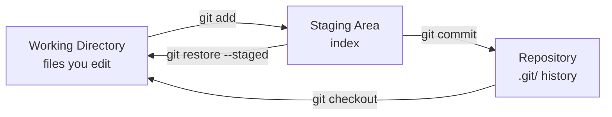

# Chapter 9 — Commits

## Overview: The Fundamental Unit of Work

A commit is the fundamental unit of Git history. Every commit records:

- A snapshot of all staged files at that moment
- A unique identifier (SHA-1 hash)
- The author's name and email
- A timestamp
- A commit message
- A reference to the parent commit(s)

Writing good commits is one of the most important skills in this handbook.
A well-maintained commit history is a research asset — it tells the story
of how the code evolved and why each change was made.

---

## The Staging Area

Before a commit is created, changes must pass through the **staging area** (also called
the **index**). This is a preparatory zone between your working directory and the repository.



The staging area gives you fine-grained control: you can edit five files but only
commit changes from two of them, keeping the other three for a separate commit.

---

## The Anatomy of a Good Commit Message

A good commit message has two parts: a **subject line** and an optional **body**.

```
Add thermal correction to effective potential

Implements the one-loop thermal correction following Eq. 3.7 of
Quiros (1999). The correction applies only when T > 0 and is
controlled by the new `include_thermal` parameter.

Closes #42.
```

**Subject line rules:**

- Use the **imperative mood**: "Add", "Fix", "Remove", "Improve", "Refactor"
- Maximum 72 characters
- No period at the end
- Describe *what* the commit does, not *how*

**Body rules (optional but valuable):**

- Leave a blank line between subject and body
- Explain *why* the change was made
- Reference relevant equations, papers, or issue numbers
- Describe any non-obvious side effects

---

## Imperative Tense: The Rule

Use the imperative because a commit message completes the sentence:
**"If applied, this commit will ___."**

| ✓ Good (imperative) | ✗ Bad |
|---------------------|-------|
| Add thermal correction | Added thermal correction |
| Fix interpolation overflow | Fixed interpolation overflow |
| Remove deprecated function | Removing deprecated function |
| Improve performance of solver | Better solver |
| Update documentation for API | docs |

Avoid these vague messages that appear in every bad Git history:
`update`, `fix`, `changes`, `final`, `temp`, `wip`, `test`, `misc`, `cleanup`

---

## Commit Granularity: Atomic Commits

Each commit should represent exactly **one logical change**.

Think of commits like paragraphs in a paper — each one covers one topic.
Mixing unrelated changes in a commit is like writing a paragraph that covers both
the introduction and the conclusion simultaneously.

**Good atomic commit sequence:**

```
Add thermal integral function
Add unit test for thermal integral
Fix sign error in thermal integral
Add docstring for thermal integral
```

**Bad non-atomic commit:**

```
Add thermal integral, fix bug, update docs, remove old code, and misc cleanup
```

The bad commit is impossible to trace. If a bug is introduced, you cannot identify
which of the five changes caused it.

**When to commit:**

- After completing a logical unit of work (a function, a test, a documentation section)
- Before switching to a completely different task
- Before the end of a work session (do not leave uncommitted changes overnight)
- Not necessarily every file save

---

## Essential Commands

### Check what has changed

```bash
git status
```

Shows modified, staged, and untracked files.

### See the diff of unstaged changes

```bash
git diff
```

### See the diff of staged changes (what will be committed)

```bash
git diff --staged
```

**Always run `git diff --staged` before committing.** This is your final review
of what you are about to record permanently.

### Stage specific files

```bash
git add src/thermal.py
git add tests/test_thermal.py
```

### Stage interactively (select specific hunks)

```bash
git add -p
```

This is invaluable when a file contains multiple unrelated changes.
Git shows each change section by section and you answer `y` (yes) or `n` (no).

### Create a commit

```bash
git commit -m "Add thermal correction to effective potential"
```

### Amend the most recent commit (before pushing)

If you made a typo in the message or forgot to stage a file:

```bash
git add forgotten-file.py
git commit --amend
```

!!! warning "Only amend unpushed commits"
    `git commit --amend` rewrites history. Never amend a commit that has already
    been pushed to GitHub (unless no one else has seen it). Once pushed and reviewed,
    the commit is permanent.

### View commit history

```bash
git log --oneline          # compact one-line view
git log --oneline -10      # last 10 commits
git log --oneline --graph  # show branch structure
```

---

## What Not to Commit

The `.gitignore` file at the root of the repository excludes common unwanted files.
Understand what it covers and never force-add these items.

| Category | Examples | Reason |
|----------|----------|--------|
| Binary outputs | `*.pdf`, `*.png`, `figure.eps` | Large, regenerated, not diffable |
| Large data | `*.hdf5`, `*.dat`, `data/` | Bloats repository size permanently |
| Generated code | `__pycache__/`, `*.pyc`, `*.o`, `build/` | Rebuilt automatically |
| OS junk | `.DS_Store`, `Thumbs.db` | Machine-specific, meaningless |
| Editor files | `.vscode/`, `*.swp`, `*.idea/` | Machine-specific |
| Credentials | `.env`, `config.secret`, `api_key.txt` | Security risk |
| Jupyter checkpoints | `.ipynb_checkpoints/` | Auto-generated noise |

If you accidentally staged one of these, unstage it:

```bash
git reset HEAD filename
```

---

## Common Mistakes

1. **Committing generated files or data.** Check `git status` before `git add .`.
   If you see files that should not be tracked, add them to `.gitignore`.

2. **Vague commit messages.** Future you (and your colleagues) will not understand
   `"fix stuff"`. Write messages that make sense six months later.

3. **Commits that mix unrelated changes.** Stage carefully. Use `git add -p`
   to split a file's changes across multiple commits.

4. **Committing broken code.** A commit on a feature branch is not required to
   be perfect, but it should not crash or produce obviously wrong results.
   Others may checkout your branch to review it.

5. **Amending pushed commits.** This rewrites history and forces collaborators
   to reset their local copy. Only amend before pushing.

---

## Best Practice Summary

- Each commit = one logical change.
- Subject line: imperative, ≤72 characters, no period.
- Always run `git diff --staged` before committing.
- Never commit generated files, data, or credentials.
- Only amend commits before they are pushed.

---

## Checklist

- [ ] I understand the staging area and how `git add` works.
- [ ] I can write a commit message in the imperative mood.
- [ ] I know what an atomic commit is and why it matters.
- [ ] I know how to use `git add -p` for selective staging.
- [ ] I always run `git diff --staged` before committing.
- [ ] I know what files should never be committed.

---

## Exercises

1. **Message rewrite.** Rewrite the following bad commit messages into good ones:
   - `"update"`
   - `"fixed the bug"`
   - `"changes to thermal.py and tests and also updated README"`
   - `"wip"`

2. **Atomic commit practice.** Make three unrelated edits to three different files.
   Stage and commit them as three separate atomic commits (one per file).
   Verify with `git log --oneline`.

3. **`git add -p` practice.** In a single file, make two completely unrelated changes
   (e.g., fix a typo on line 5 and add a new function at the bottom).
   Use `git add -p` to stage only the typo fix. Commit it. Then stage and commit
   the new function separately.
