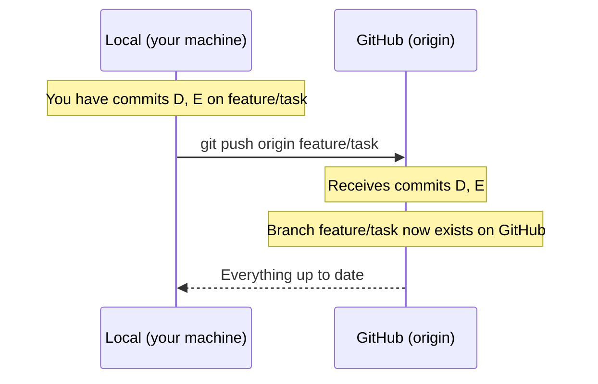

# Chapter 10 — Pushing

## Overview: Uploading Your Work to GitHub

Pushing transfers commits from your local repository to the remote (GitHub).
It is how your work becomes visible to colleagues and how Pull Requests are created.

Pushing is safe on your own feature branches. The rules around pushing protect
`main` — you cannot push directly to `main` at all.

---

## What `git push` Does



Push sends all new commits on your current branch to the corresponding branch on GitHub.
If the branch does not yet exist on GitHub, it is created.

---

## First Push: Setting the Upstream

When you push a branch for the first time, use the `-u` flag to set the **upstream tracking**:

```bash
git push -u origin feature/thermal-correction
```

The `-u` (or `--set-upstream`) flag links your local branch to the remote branch.
After this, Git knows that `feature/thermal-correction` tracks `origin/feature/thermal-correction`,
and future pushes and pulls can be shortened.

After the first push, subsequent pushes on the same branch require only:

```bash
git push
```

Without `-u`, you would need to type the full `git push origin feature/thermal-correction` every time.

---

## Push Output Explained

```
Enumerating objects: 7, done.
Counting objects: 100% (7/7), done.
Delta compression using up to 8 threads
Compressing objects: 100% (4/4), done.
Writing objects: 100% (5/5), 1.23 KiB | 1.23 MiB/s, done.
Total 5 (delta 2), reused 0 (delta 0), pack-reused 0
remote: Resolving deltas: 100% (2/2), completed with 1 local object.
remote:
remote: Create a pull request for 'feature/thermal-correction' on GitHub by visiting:
remote:      https://github.com/Meridex/REPO/pull/new/feature/thermal-correction
remote:
To github.com:ORG/REPO.git
 * [new branch]      feature/thermal-correction -> feature/thermal-correction
Branch 'feature/thermal-correction' set up to track remote branch 'feature/thermal-correction' from 'origin'.
```

Key line:
```
remote:      https://github.com/Meridex/REPO/pull/new/feature/thermal-correction
```

Click this URL (or copy it into your browser) to open a Pull Request directly.

---

## What Happens on GitHub After a Push

1. The branch `feature/thermal-correction` appears in the repository's branch list.
2. GitHub shows a yellow banner: **"feature/thermal-correction had recent pushes. Compare & pull request"**
3. Colleagues can browse your branch on GitHub before you even open a PR.

---

## Pushing Multiple Times (During Review)

It is normal and expected to push multiple times to the same branch.
Every time you address reviewer feedback, you commit and push:

```bash
git add src/thermal.py
git commit -m "Address review: fix edge case at T=0"
git push
```

The Pull Request on GitHub updates automatically — no need to close and reopen it.

---

## Force Push: When It Is Appropriate

A **force push** overwrites the remote branch history with your local history.
This is needed after:

- `git commit --amend` (rewrites the most recent commit)
- `git rebase origin/main` (replays your commits, creating new commit hashes)

```bash
git push --force-with-lease
```

!!! danger "Use `--force-with-lease`, never `--force`"
    `--force-with-lease` is a safer variant of `--force`. It checks that no one
    else has pushed to the remote branch since you last fetched. If someone has
    pushed, the command refuses — protecting against accidentally overwriting
    a colleague's work.

    `--force` provides no such protection. Never use it.

**Rules for force push:**

- ✓ Your own feature branch, before or during review
- ✓ After `git rebase origin/main` on your own branch
- ✗ Never force-push to `main` (blocked by branch protection)
- ✗ Never force-push a branch that another person has checked out

---

## Push Rejection: What It Means

If `git push` is rejected:

```
 ! [rejected]        feature/thermal-correction -> feature/thermal-correction (non-fast-forward)
error: failed to push some updates to 'git@github.com:ORG/REPO.git'
hint: Updates were rejected because the tip of your current branch is behind
hint: its remote counterpart. Integrate the remote changes (e.g.
hint: 'git pull ...') before pushing again.
```

This means the remote branch has commits your local branch does not have.
This happens if you rebased or amended after a previous push.

Resolution:

```bash
git push --force-with-lease
```

If the rejection is because someone else pushed to the branch (not because of a rebase),
do **not** force push. Fetch and integrate their changes first.

---

## Never Push to `main`

Direct pushes to `main` are blocked by branch protection rules on GitHub.
If you accidentally try:

```
remote: error: GH006: Protected branch update failed for refs/heads/main.
remote: error: - At least 1 approving review is required by reviewers.
To github.com:ORG/REPO.git
 ! [remote rejected] main -> main (protected branch hook declined)
```

This is the protection working correctly. Create a branch and open a PR instead.

---

## Common Mistakes

1. **Forgetting `-u` on first push.** Your local branch will not track the remote,
   and subsequent `git push` commands will require the full `origin branch-name`.
   Fix with: `git branch --set-upstream-to=origin/feature/task`.

2. **Using `--force` instead of `--force-with-lease`.** Always use `--force-with-lease`.

3. **Pushing to `main` directly.** Not possible due to branch protection, but the error
   message is confusing. Create a branch.

4. **Pushing before committing.** Uncommitted changes are never pushed — only committed
   changes are sent. Run `git status` to confirm your changes are committed.

---

## Best Practice Summary

- Use `git push -u origin branch-name` the first time; `git push` thereafter.
- Push early to back up your work, even if the PR is not yet ready (use a Draft PR).
- After rebasing, use `git push --force-with-lease`.
- Never use `--force`; always use `--force-with-lease`.
- Never push directly to `main`.

---

## Checklist

- [ ] I understand what `git push` does (uploads local commits to GitHub).
- [ ] I know to use `-u` on the first push of a branch.
- [ ] I know the difference between `--force` and `--force-with-lease`.
- [ ] I know when a force push is appropriate and when it is not.
- [ ] I know why pushing to `main` directly is blocked.

---

## Exercises

1. **First push.** Using your branch from the Chapter 8 exercises (`feature/exercise-test`),
   push it to GitHub using the correct command for a first push. Verify the branch
   appears in the GitHub repository.

2. **Force push scenario.** On your `feature/exercise-test` branch, make a commit.
   Then amend it (`git commit --amend` to change the message). Try a regular push
   and observe the error. Resolve it with `--force-with-lease`.

3. **Push rejection diagnosis.** Without looking at this chapter, write in your own
   words: why does Git reject a push with "non-fast-forward" and how do you resolve it?
