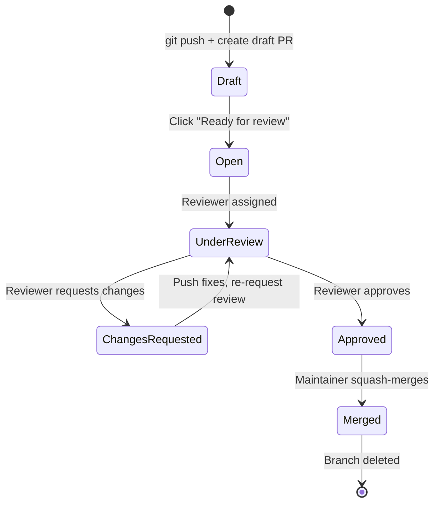

# Chapter 11 — Pull Requests

## Overview: The Review Gate

A Pull Request (PR) is a formal proposal to merge your feature branch into `main`.
It is the central mechanism of the group workflow — every change to `main` goes through one.

A PR serves three purposes simultaneously:

1. **Review** — a colleague reads your code before it becomes permanent.
2. **Discussion** — questions, suggestions, and decisions are recorded on the PR page.
3. **History** — the merged PR is a permanent, searchable record of what changed and why.

A PR is not a sign that your work is "done" — it is an invitation to collaborate.

---

## When to Open a PR

Open a PR when your branch is ready for another person to read and give feedback.

- It does **not** need to be perfect.
- It does **not** need to pass all tests (though it should try).
- It does need to represent a **focused, complete unit of work**.

**Draft PRs** are for work in progress. Use them when you want early feedback
or want to back up your work on GitHub without formally requesting review.

```
Draft PR  → signals "not ready for final review yet"
Open PR   → signals "please review this"
```

To convert a Draft PR to a ready PR: click **"Ready for review"** on the PR page.

---

## Opening a Pull Request

After pushing your branch:

1. Go to the repository on GitHub.
2. Click **"Compare & pull request"** in the yellow banner, or go to
   **Pull Requests → New pull request**.
3. Verify:
   - **Base branch:** `main`
   - **Compare branch:** your feature branch
4. Fill in the PR form (see next section).
5. Assign a reviewer.
6. Click **"Create pull request"** (or **"Create draft pull request"**).

---

## PR Anatomy: Writing a Good Description

A well-written PR description is as important as the code itself. It gives
the reviewer the context they need to evaluate your changes efficiently.

Use the group's PR template:

```markdown
## Motivation
<!-- Why is this change needed? What problem does it solve? -->
The thermal correction was missing from the effective potential calculation,
causing incorrect phase boundary predictions at T > 0.

## Summary of Changes
<!-- High-level description of what was changed. -->
- Added `thermal_correction()` function in `src/thermal.py`
- Integrated the correction into `EffectivePotential.compute()`
- Added unit tests in `tests/test_thermal.py`

## Files Affected
- `src/thermal.py` (new file)
- `src/potential.py` (modified: integrate thermal correction)
- `tests/test_thermal.py` (new file)

## Testing Performed
```bash
python -m pytest tests/test_thermal.py -v
# All 6 tests pass
```

## Related Issue
Closes #42
```

**PR title:** Use the same imperative rule as commit messages.
The title should complete: "If merged, this PR will ___."

- ✓ `Add thermal correction to effective potential`
- ✓ `Fix interpolation overflow at high temperature`
- ✗ `thermal stuff`
- ✗ `Updates to potential.py`

---

## Assigning Reviewers

In the right sidebar of the PR page, click **Reviewers** and select a group member.

Group policy:
- Every PR requires **at least one approval** before it can be merged.
- Assign the reviewer who is most familiar with the code area you changed.
- If unsure who to assign, ask the maintainer.

The assigned reviewer will receive a GitHub notification and email.

---

## Labels and Linking to Issues

**Labels** categorise your PR for easy filtering. Apply at least one:

- `type: feature`, `type: bugfix`, `type: docs`, `type: refactor`, etc.

**Linking to an issue** closes it automatically when the PR merges:

In the description, write:
```
Closes #42
```

When the PR is merged, Issue #42 is automatically closed. This keeps the issue
tracker clean without manual follow-up.

---

## The PR Lifecycle



---

## Responding to Review Comments

When a reviewer leaves comments:

1. **Read all comments before making any changes.** Some comments may conflict;
   understanding the full picture first saves redundant work.

2. **For each required change:**
   - Make the change in your editor.
   - `git add` and `git commit` with a message like:
     `"Address review: fix edge case at T=0"`
   - `git push`

3. **Reply to each comment** on GitHub explaining what you did.
   If you disagree with a comment, explain your reasoning politely.

4. **Mark resolved** when a comment is addressed.

5. **Request a re-review** when all comments are addressed:
   On the right sidebar, click the refresh icon next to the reviewer's name.

!!! tip "Small commits for review responses"
    When addressing review feedback, make small, focused commits.
    This makes it easy for the reviewer to see what you changed in response to their feedback.

---

## Small PRs Are Better PRs

A PR that changes 50 lines is reviewed thoroughly in 10 minutes.
A PR that changes 500 lines may sit unreviewed for days because no one wants
to tackle it.

Guidelines:
- **One PR per feature or bug fix** — do not bundle unrelated changes.
- If your task is large, split it into sequential PRs.
- A PR touching more than 300 lines (excluding tests and docs) should be discussed
  with the maintainer before opening.

---

## Common Mistakes

1. **Opening a PR to `main` from `main`.** Set the compare branch to your feature branch.

2. **Vague PR title and empty description.** A reviewer cannot assess code without context.
   Fill in all sections of the template.

3. **Not assigning a reviewer.** PRs without assigned reviewers go unnoticed.

4. **Opening a new PR for every review iteration.** Push new commits to the existing
   branch. The PR updates automatically.

5. **Mixing unrelated changes in one PR.** Keep PRs focused. If you notice a bug
   while working on a feature, fix it in a separate branch and PR.

---

## Best Practice Summary

- Open a PR as soon as a branch is ready for feedback — it need not be perfect.
- Use Draft PRs for work in progress.
- Fill in all sections of the PR template — title, motivation, summary, testing.
- Assign a reviewer; apply labels; link to the related issue.
- Respond to every review comment; mark resolved when done.
- Keep PRs small and focused (one feature or bug fix per PR).

---

## Checklist

- [ ] My PR title is in the imperative mood and describes the change clearly.
- [ ] I filled in all sections of the PR template.
- [ ] I assigned at least one reviewer.
- [ ] I applied appropriate labels.
- [ ] I linked to the related issue with `Closes #N`.
- [ ] The base branch is `main` and the compare branch is my feature branch.

---

## Exercises

1. **Open a PR.** Using your `feature/exercise-test` branch from earlier exercises,
   open a Pull Request against `main` (or the designated practice repository).
   Fill in all sections of the template with realistic content.

2. **Review a PR.** Find an open PR in the group repository (or ask a colleague to
   create one). Leave at least one constructive comment using the GitHub review interface.

3. **PR title rewrite.** Rewrite the following bad PR titles:
   - `"stuff"`
   - `"updated thermal.py"`
   - `"fixing the bug that was causing issues"`
   - `"wip: not done yet"`
