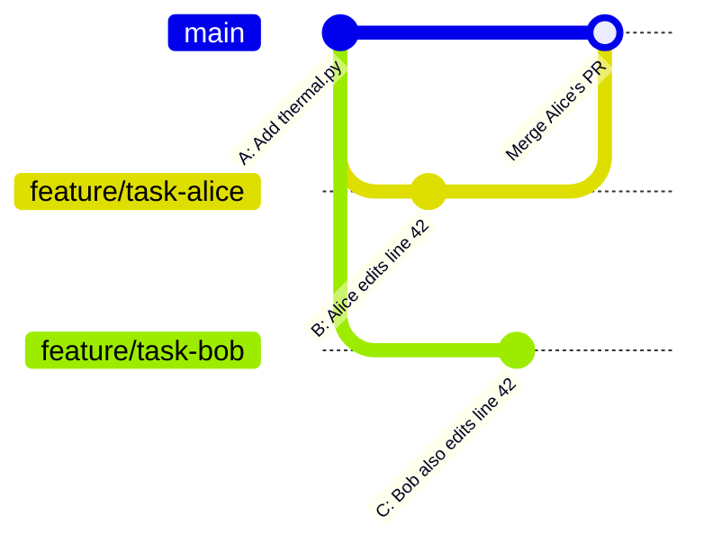

# Chapter 13 — Merge Conflicts

## Overview: When Two Branches Disagree

A merge conflict occurs when two branches have both modified the same lines of a file,
and Git cannot automatically decide which version to keep.

**Conflicts are normal. They are not a sign of error or bad practice.**

Every developer who works in a collaborative environment encounters conflicts regularly.
The goal is not to avoid them but to resolve them confidently and correctly.

---

## Why Conflicts Happen



When Bob's branch tries to merge after Alice's, Git sees that line 42 was changed
in two incompatible ways. Neither version is automatically "correct" — a human
must decide.

---

## Conflict Markers

When a conflict occurs, Git inserts markers into the file:

```python
def thermal_mass_squared(phi, T):
<<<<<<< HEAD
    # Alice's version: using improved Daisy resummation
    return g_squared * (T**2 / 12 + phi**2 / 4) + daisy_correction(phi, T)
=======
    # Bob's version: simple one-loop result
    return g_squared * T**2 / 12
>>>>>>> feature/task-bob
```

| Marker | Meaning |
|--------|---------|
| `<<<<<<< HEAD` | Start of the current branch's version |
| `=======` | Separator between the two versions |
| `>>>>>>> feature/task-bob` | End of the incoming branch's version |

**Your task:** Replace everything from `<<<<<<< HEAD` to `>>>>>>> feature/task-bob`
with the correct merged result.

---

## How to Resolve a Conflict

### Step 1: Understand the conflict

Before editing, read both versions and understand:
- What did you change and why?
- What did the other branch change and why?
- Are the changes compatible? (Can both be kept?)
- Which is scientifically correct?

If you are uncertain about the other person's changes, **ask them before resolving.**
Merge conflicts in scientific code can have physically significant consequences.

### Step 2: Open VS Code's merge editor (recommended)

VS Code detects conflict markers and shows a dedicated merge editor with
three panels: "Current" (your branch), "Incoming" (theirs), and "Result".

Click buttons to:
- **Accept Current Change** — keep your version
- **Accept Incoming Change** — keep their version
- **Accept Both Changes** — keep both (appended or combined)
- Edit the **Result** panel directly for a custom merge

### Step 3: Resolve in a terminal editor (alternative)

Open the file, find the conflict markers, and manually edit:

```python
def thermal_mass_squared(phi, T):
    # Combined: use improved Daisy resummation (Alice) with one-loop baseline (Bob)
    return g_squared * (T**2 / 12 + phi**2 / 4) + daisy_correction(phi, T)
```

Remove **all three markers** (`<<<<<<<`, `=======`, `>>>>>>>`).
Leaving any marker in the file is a broken state.

### Step 4: Stage the resolved file

```bash
git add src/thermal.py
```

### Step 5: Continue the rebase (if resolving during a rebase)

```bash
git rebase --continue
```

Or, if resolving during a merge:

```bash
git commit
```

### Step 6: Test

**Always run your tests after resolving a conflict.**
A conflict resolution that looks correct syntactically may be physically wrong.

```bash
python -m pytest
```

---

## Resolving a Conflict During Rebase

The most common scenario: you rebase your branch onto `main` and encounter a conflict.

```bash
git fetch origin
git rebase origin/main
# Auto-merging src/thermal.py
# CONFLICT (content): Merge conflict in src/thermal.py
# error: could not apply a3f2c91... Add thermal correction
# hint: Resolve all conflicts manually, mark them as resolved with
# hint: "git add/rm <conflicted_files>", then run "git rebase --continue".
```

Resolution steps:

```bash
# 1. Open the conflicted file and resolve
code src/thermal.py

# 2. After resolving, stage the file
git add src/thermal.py

# 3. Continue the rebase
git rebase --continue

# 4. If another conflict: resolve again and continue
# To abort entirely and return to before the rebase:
git rebase --abort
```

---

## Multiple Conflicts

If a rebase has many commits and each touches conflicting files, you may encounter
multiple rounds of conflict resolution — one per conflicting commit.
Stay calm: resolve each one in order, run `git rebase --continue`, and repeat.

After all conflicts are resolved and the rebase completes, force-push the updated branch:

```bash
git push --force-with-lease
```

---

## When to Ask for Help

Complex conflicts in scientific code — where the correctness depends on the physics —
should not be resolved alone. Ask:

- The colleague whose changes conflict with yours
- The maintainer, if the conflict involves core modules
- The original author of the code, if you are unsure of the intent

It is always better to ask than to silently keep the wrong version.

---

## Common Mistakes

1. **Accidentally deleting the other person's changes.** Read both versions before
   editing. Use VS Code's merge editor to see both sides clearly.

2. **Leaving conflict markers in the file.** After resolving, run a search for
   `<<<<<<<` to confirm no markers remain:
   ```bash
   grep -r "<<<<<<" .
   ```

3. **Not testing after resolution.** A syntactically correct merge may be scientifically wrong.

4. **Using `git merge --abort` when you meant `git rebase --abort`.** Know which
   operation you started. Check `git status` when in doubt.

5. **Force-pushing without `--lease`.** Use `git push --force-with-lease`, not `--force`.

---

## Best Practice Summary

- Conflicts are normal; approach them calmly.
- Understand both versions before editing.
- Use VS Code's merge editor for visual clarity.
- Remove all three conflict markers before staging.
- Always run tests after resolving.
- Ask the author of the conflicting change if the physics is ambiguous.

---

## Checklist

- [ ] I understand what causes a merge conflict.
- [ ] I know how to read conflict markers (`<<<<<<<`, `=======`, `>>>>>>>`).
- [ ] I know how to resolve a conflict using VS Code's merge editor.
- [ ] I know the steps: resolve → `git add` → `git rebase --continue`.
- [ ] I always run tests after resolving a conflict.
- [ ] I know when to ask for help.

---

## Exercises

1. **Simulate a conflict.** In a practice repository:
   - On `feature/branch-a`: edit line 5 of a file and commit.
   - On `feature/branch-b` (branched from the same point): edit line 5 differently and commit.
   - Merge `branch-a` into `main`, then try to rebase `branch-b` onto `main`.
   - Resolve the conflict and complete the rebase.

2. **VS Code merge editor.** Open a file with conflict markers in VS Code.
   Use the merge editor buttons to resolve the conflict. Verify no markers remain.

3. **grep check.** After resolving any conflict, run `grep -r "<<<<<<" .` to verify
   no markers were accidentally left in the codebase.
