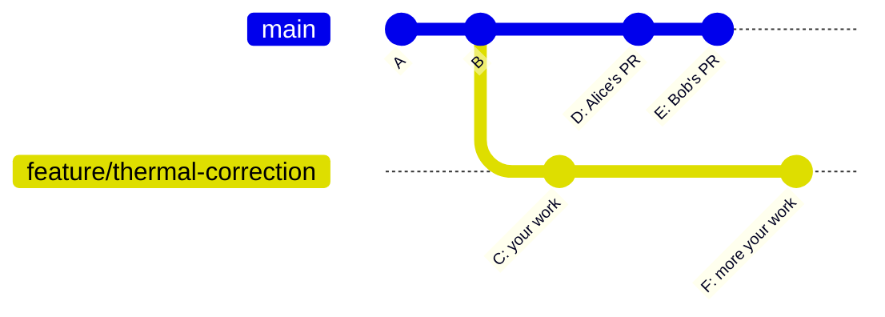

# Chapter 14 — Updating Branches

## Overview: Staying in Sync with `main`

When you are working on a feature branch that takes several days or weeks,
`main` will receive other people's merged PRs in the meantime.
Your branch gradually diverges from `main`.



At this point, your branch is based on commit B, while `main` is at E.
Before opening a PR, you should update your branch to be based on the latest `main`.

---

## Rebase: The Group's Preferred Strategy

The group uses **rebase** to update feature branches.

Rebase replays your commits on top of the latest `main`, creating a linear history:

```
Before rebase:                After rebase:
                              
main:    A - B - D - E        main:    A - B - D - E
                                                    \
feature: A - B - C - F        feature:              C' - F'
```

Your commits C and F are **replayed** as new commits C' and F' on top of E.
The content is the same; the parent commits are different.

---

## Step-by-Step: Rebase Onto `main`

```bash
# 1. Fetch the latest changes from GitHub
git fetch origin

# 2. Check how far main has advanced
git log --oneline origin/main

# 3. Rebase your branch onto the latest main
git rebase origin/main
```

If there are no conflicts, this completes silently and your branch is now
based on the latest `main`.

If conflicts occur, resolve them following Chapter 13, then continue:

```bash
git rebase --continue
```

After rebase, your branch history has been rewritten (new commit hashes).
Force-push to update GitHub:

```bash
git push --force-with-lease
```

---

## Rebase vs Merge: Why Rebase?

The alternative to `git rebase` is `git merge`:

```bash
# Merge approach (not the group standard):
git merge origin/main
```

Merge creates a **merge commit** that ties the two histories together.
The result looks like:

```
feature: A - B - C - F - M
                      |
main:    A - B - D - E
```

Where M is a new merge commit connecting E and F.

| | Rebase | Merge |
|--|--------|-------|
| History shape | Linear | Graph with branches |
| `main` log readability | Clean | Cluttered with merge commits |
| PR diff | Shows only your changes | May include noise from the merge |
| Group policy | **Required** | Not used for branch updates |

Rebase produces a cleaner history that is easier to read and review.

!!! warning "Rebase rewrites history"
    Because rebase creates new commits (with new hashes), you must force-push after rebasing.
    Use `git push --force-with-lease`.
    Never rebase a branch that other people have already based work on.
    For private feature branches (the normal case), this is always safe.

---

## `--force-with-lease` vs `--force`

| Flag | Behaviour | When to use |
|------|-----------|------------|
| `--force-with-lease` | Checks that no one else pushed since you last fetched | Always |
| `--force` | Overwrites unconditionally | Never |

```bash
# Correct:
git push --force-with-lease

# Dangerous — do not use:
git push --force
```

`--force-with-lease` refuses if someone else has pushed to the remote branch since
you last fetched. This protects you from accidentally overwriting a colleague's
commits.

---

## When to Update Your Branch

Update (rebase) your branch in these situations:

1. **Before opening a PR.** Your branch should be based on the latest `main`
   so the reviewer does not need to mentally subtract `main`'s changes from your diff.

2. **When `main` has changed significantly.** If a colleague merged changes to files
   you are also editing, update sooner rather than later to avoid large conflict sessions.

3. **When a reviewer asks you to rebase.** Sometimes a PR review includes the instruction
   to rebase because `main` has changed since the PR was opened.

4. **When GitHub shows "This branch is out of date with the base branch."**
   The PR page shows this warning when `main` has advanced past your branch's base commit.

---

## Checking How Far Behind You Are

```bash
git fetch origin
git log --oneline HEAD..origin/main
```

This shows commits that are on `origin/main` but not on your current branch.
If this list is empty, you are up to date.

---

## Aborting a Rebase

If a rebase goes wrong and you want to cancel:

```bash
git rebase --abort
```

This returns your branch to exactly the state it was in before you started the rebase.
No changes are lost.

---

## Common Mistakes

1. **Using `git merge origin/main` instead of `git rebase origin/main`.**
   This creates a merge commit on your feature branch, which clutters the PR diff.

2. **Not fetching before rebasing.**
   ```bash
   # Wrong (rebases onto your local copy of main, which may be stale):
   git rebase main

   # Correct (rebases onto the actual current state of main on GitHub):
   git rebase origin/main
   ```
   Always `git fetch origin` before rebasing.

3. **Force-pushing to `main`.** The force push after rebase should only target
   your feature branch.

4. **Using `--force` instead of `--force-with-lease`.** Always use `--force-with-lease`.

5. **Rebasing a branch that others have checked out.** If a colleague has branched
   from your branch or is reviewing it with local checkout, rewriting history
   will break their copy. Coordinate first.

---

## Best Practice Summary

- Use `git rebase origin/main` (not `git merge`) to update feature branches.
- Always `git fetch origin` before rebasing to get the latest remote state.
- After rebase, use `git push --force-with-lease` to update GitHub.
- Update before opening a PR and whenever `main` has changed significantly.
- Use `git rebase --abort` to safely cancel a rebase that goes wrong.

---

## Checklist

- [ ] I understand the difference between rebase and merge for branch updates.
- [ ] I know to run `git fetch origin` before `git rebase origin/main`.
- [ ] I know to use `git push --force-with-lease` after rebasing.
- [ ] I know when to update my branch (before PR, when main advances).
- [ ] I know how to abort a rebase with `git rebase --abort`.

---

## Exercises

1. **Simulate a diverged branch.** Create `feature/branch-a`. Switch to `main`,
   make a commit there (or pull a new commit from the remote). Switch back to
   `feature/branch-a` and run `git log --oneline HEAD..origin/main` to see the divergence.
   Then rebase.

2. **Rebase with a conflict.** Extend the conflict scenario from Chapter 13.
   After resolving the conflict during rebase, verify with `git log --oneline --graph`
   that the history is linear.

3. **Before and after comparison.** Run `git log --oneline --graph` before and after
   a rebase. Note how the graph changes from a two-branch shape to a linear shape.
