# 05 · Diagrams Plan

All diagrams use **Mermaid** so they render natively on GitHub and in MkDocs.
Source lives in `docs/assets/diagrams/`. Each diagram is also embedded inline
in the chapter where it first appears.

---

## Diagram Inventory

### D-01 — Git/GitHub Relationship
**Chapter:** Student Guide Ch. 2
**Type:** `graph LR`

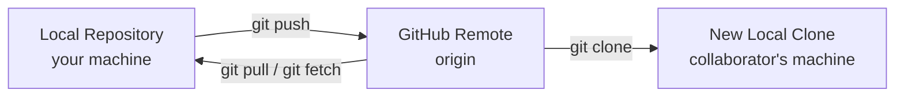

**Purpose:** Show that Git is local; GitHub is just a remote host.

---

### D-02 — Full Group Workflow
**Chapter:** Student Guide Ch. 3, Maintainer Guide Ch. 9
**Type:** `flowchart TD`

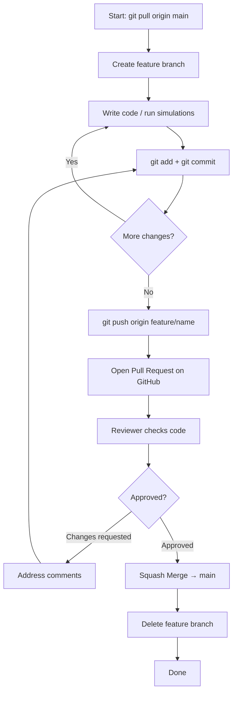

**Purpose:** The canonical workflow every student must internalise.

---

### D-03 — Branch Graph
**Chapter:** Student Guide Ch. 3, Ch. 8
**Type:** `gitGraph`

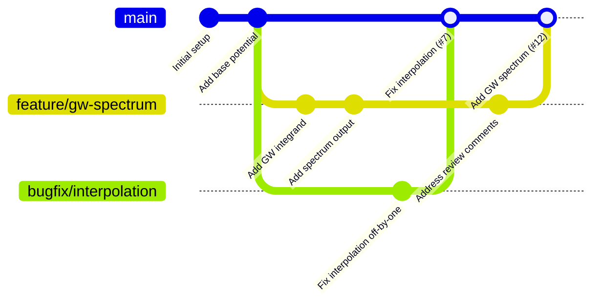

**Purpose:** Show parallel branches and squash merges on `main`.

---

### D-04 — Clone Operation
**Chapter:** Student Guide Ch. 6
**Type:** `sequenceDiagram`

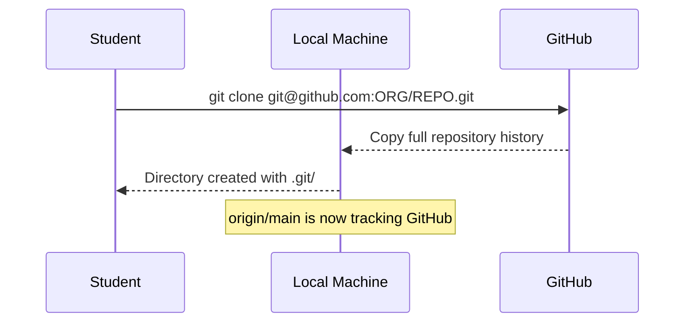

**Purpose:** Demystify what `git clone` does under the hood.

---

### D-05 — Daily Workflow Loop
**Chapter:** Student Guide Ch. 7
**Type:** `flowchart TD`

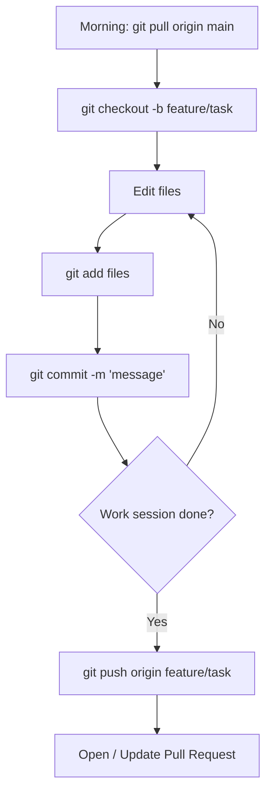

**Purpose:** The loop students repeat every working day.

---

### D-06 — Staging Area Model
**Chapter:** Student Guide Ch. 9
**Type:** `graph LR`

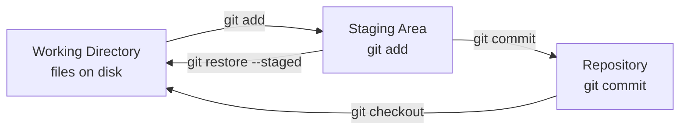

**Purpose:** Show the three Git states (working / staged / committed).

---

### D-07 — Pull Request Lifecycle
**Chapter:** Student Guide Ch. 11
**Type:** `stateDiagram-v2`

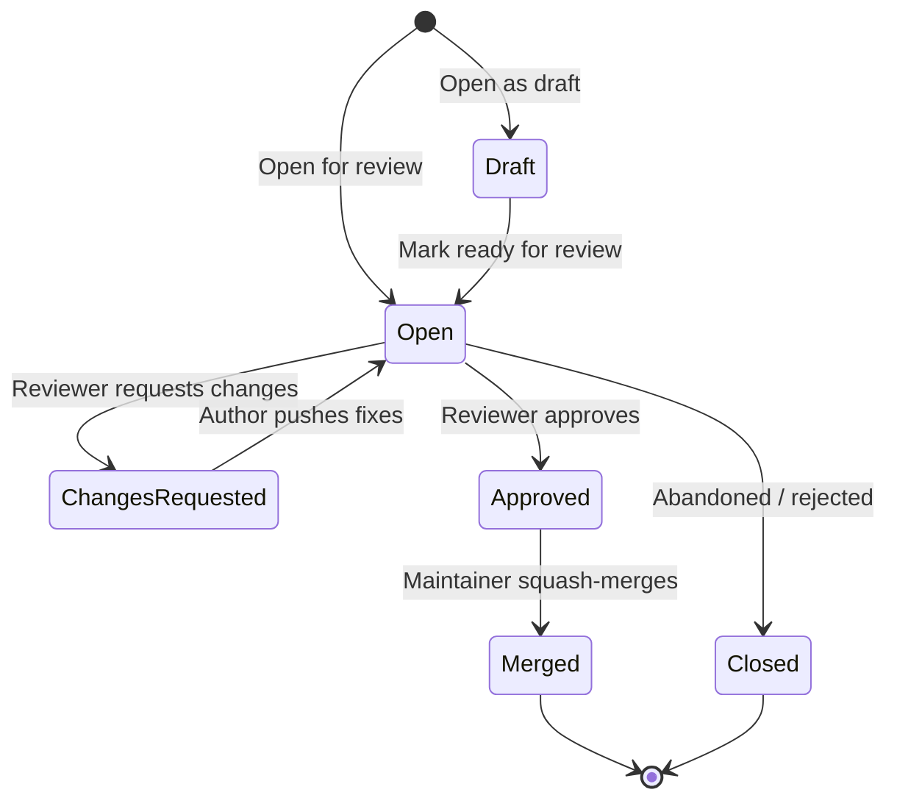

**Purpose:** Show every possible state of a PR.

---

### D-08 — Conflict Marker Explanation
**Chapter:** Student Guide Ch. 13
**Type:** Text diagram (no Mermaid needed — use annotated code block)

Content: Annotated conflict block showing what `HEAD`, `=======`, and the
branch name mean, with labels indicating "your change" and "their change".

---

### D-09 — Rebase vs Merge
**Chapter:** Student Guide Ch. 14
**Type:** `gitGraph` (two separate diagrams — before/after)

**Before rebase:**
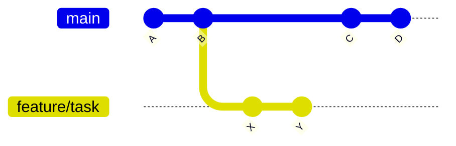

**After rebase:**
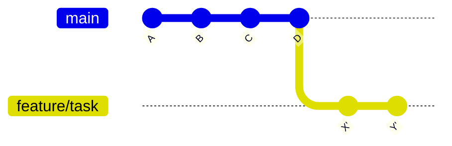

**Purpose:** Show why rebase produces a cleaner history.

---

### D-10 — Squash Merge Result
**Chapter:** Maintainer Guide Ch. 9
**Type:** `gitGraph` (before/after)

Show a feature branch with 4 noisy commits (wip, fix, fix2, cleanup) becoming
one clean commit on `main`.

---

### D-11 — Release Timeline
**Chapter:** Maintainer Guide Ch. 10, Ch. 11
**Type:** `timeline` (or `gitGraph` with tags)

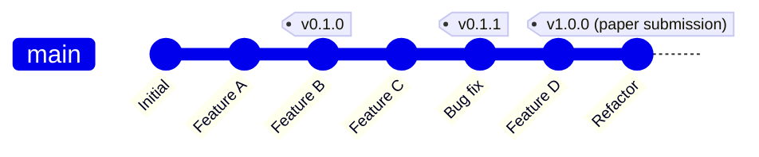

**Purpose:** Connect releases and tags to the development timeline.

---

### D-12 — Repository Permission Levels
**Chapter:** Maintainer Guide Ch. 4
**Type:** `graph TD`

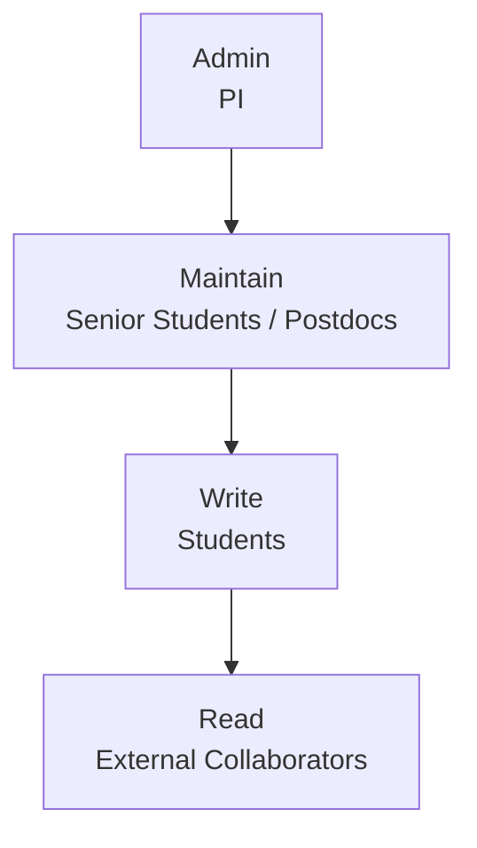

**Purpose:** Show the access hierarchy clearly.

---

### D-13 — Repository Lifecycle
**Chapter:** Maintainer Guide Ch. 16, Ch. 17
**Type:** `stateDiagram-v2`

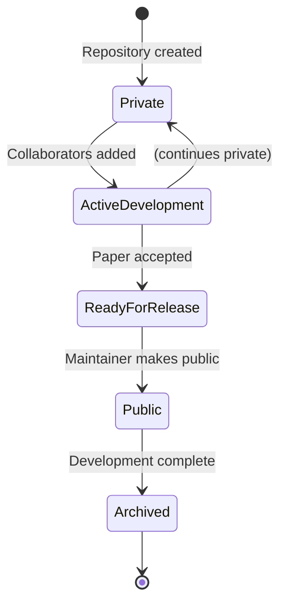

**Purpose:** Show the full lifecycle from creation to archival.

---

### D-14 — CI/CD Pipeline
**Chapter:** Maintainer Guide Ch. 14
**Type:** `flowchart LR`

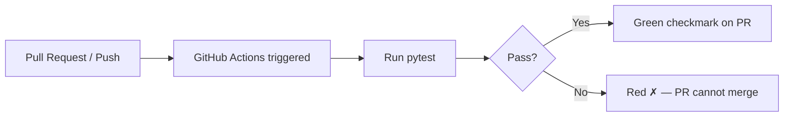

**Purpose:** Explain CI visually before showing YAML.

---

## Diagram Production Notes

- All diagrams are written as raw Mermaid in the Markdown files.
- MkDocs + `mkdocs-material` theme renders Mermaid natively with the
  `pymdownx.superfences` extension.
- For GitHub rendering: Mermaid renders in `.md` files as of 2022.
- Export to SVG only if a diagram is needed in a printed document.
- Every diagram has a figure caption below it: `*Figure N: Description.*`
